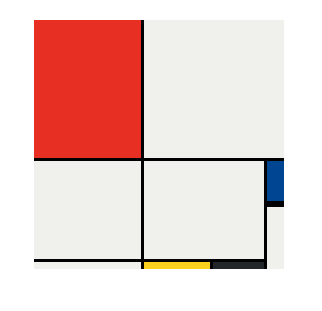

# 🎨 Mondrian Art Project

This project recreates a simplified version of Piet Mondrian's abstract art using only HTML and CSS Grid. It's a creative CSS layout exercise focusing on positioning and responsiveness.

## 🔗 Live Demo

👉 [Click here to view the Mondrian Project](https://selvarajan-m.github.io/Mondrian-Project/)

## 📂 Project Repository

🔗 [GitHub Repository](https://github.com/Selvarajan-M/Mondrian-Project)

## 🧰 Tech Stack

- **HTML5**
- **CSS3**
- **CSS Grid**
- **Git & GitHub** – for version control and hosting

## ✨ Features

- Pure HTML and CSS implementation
- Uses CSS Grid for accurate layout
- No images or JavaScript used
- Responsive design approach

## 🚀 How to Run Locally

1. **Clone the repository**:
   ```bash
   git clone https://github.com/Selvarajan-M/Mondrian-Project.git
2.**Navigate to the folder**:

```bash
  Copy
   cd Mondrian-Project
```
3.**Open index.html in your browser**

✅ No setup or dependencies required.

## 📸 Screenshot



## 👨‍💻 Author

**Selvarajan M**  
GitHub: [@Selvarajan-M](https://github.com/Selvarajan-M)

⭐️ If you liked this project, consider starring the repository!
